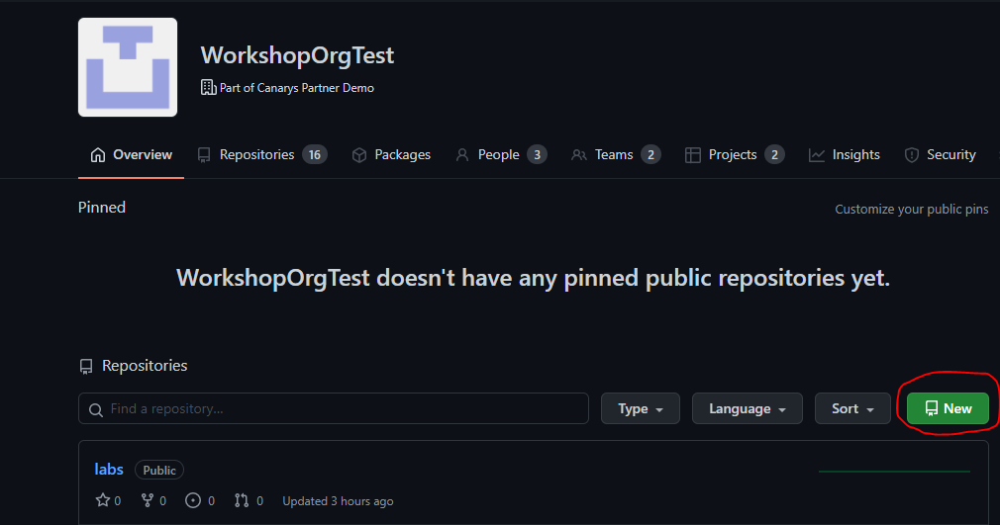
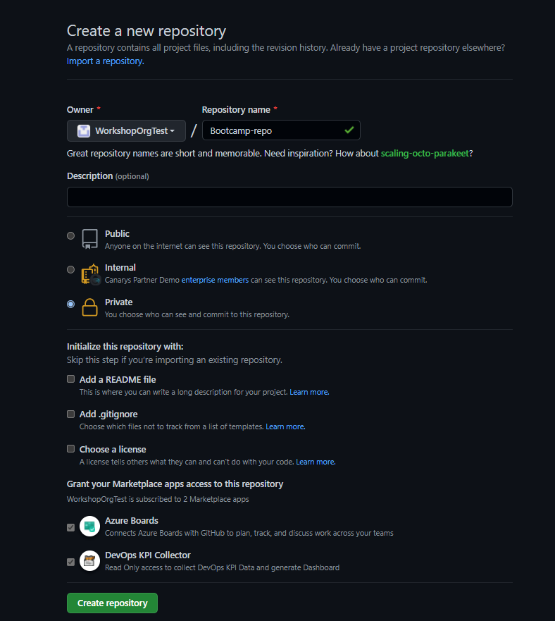
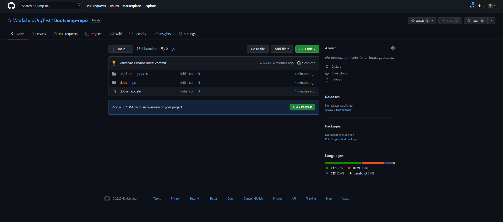

# 1.1 Adding locally hosted code to GitHub

GitHub CLI is an open source tool for using GitHub from your computer's command line. GitHub CLI can simplify the process of adding an existing project to GitHub using the command line.

## Task 1 [Time 20 minutes]

- Download the repository from [here](https://github.com/WorkshopOrgTest/labs/releases/download/1.0/dotnetrepo.zip). 
- Extract the project directory to a new location
- Track the local project using git
- Publish the local repo to your remote repository

**Create a new empty GitHub Remote Repository**
  
  
  
  
<details>
    <summary>Solution</summary>
    
  ```shell
  $ git init -b main
  $ git add . && git commit -m "initial commit"
  $ git remote add origin <REMOTE_URL>
  $ git push -u origin main  
  ```


  
> NOTE: In case you had already initialized your repo over on GitHub, you can force the code into the repo by adding `-f`. **This will overwrite your repository and its contents!**
> 
> ```shell
> $ git push --mirror -f 
> ```
  
  </details>

 ## Task 2 [Time 15 minutes]
 
  - Create .gitignore file to prevent .vs/ folder to be pushed again to remote repository from your local machine

  <details>
    <summary>Solution</summary>
    
  ```shell
  $ vim .gitignore  # Add .vs/ to the first line
  $ git rm -r --cached .vs/
  $ git commit -m "Ignoring Files" 
  $ git push
  ```
